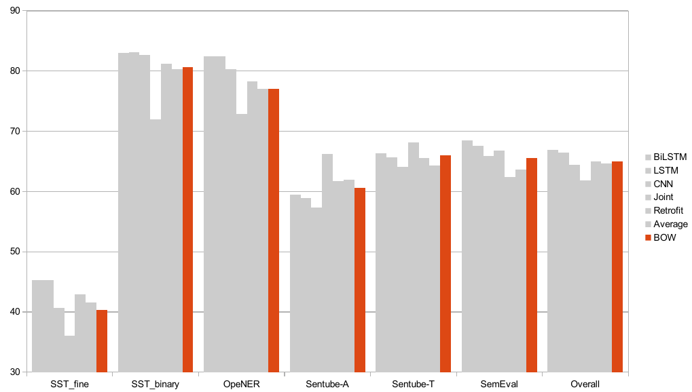
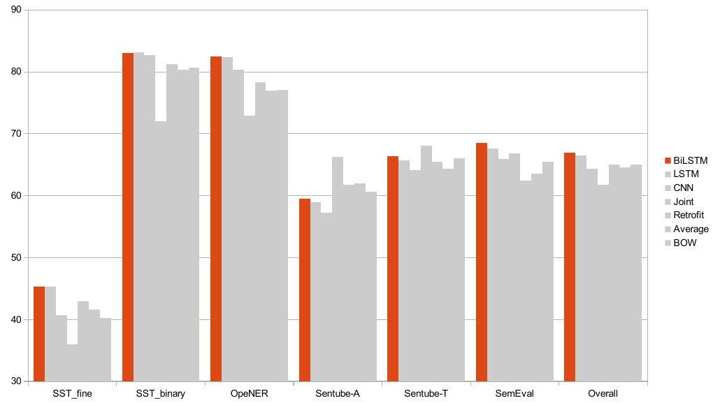

### **What is State-of-the-art in Sentiment Analysis?**
---

State-of-the-art is a tricky concept. In sentiment analysis, which approach
works best often depends on the data you have at hand, whether your interested
in knowing the general sentiment of a document or sentence, which is
dominated by neural networks,
or if you want to know what the sentiment is of a specific target entity,
where an ensemble of techniques often gives the best results. 

Another obstacle is that we often don't have the time or energy to devote 
to reimplementing others' approaches and rely on the results they present
in their papers. 

### **Experiment**
---

We were interested in seeing if any particular model was better
on a certain kind of data, or if there was one model that would perform better
overall. We decided to choose 7 standard sentiment models and look more at
some of the hyperparameters which are often ignored. 

We ran 7 different models on 6 different datasets with different characteristics [(you can find the details here](../downloads/sota_sentiment.pdf)). 

### **Results**
---

The first major surprise is that the old bag-of-words approach works amazingly
well across datasets. In fact, it comes very close to the best performing algorithms
on almost all of the datasets, as you can see in the next table.

Rather unsurprisingly given their performance on so many tasks these days, bidirectional LSTMs are
the big winners.

