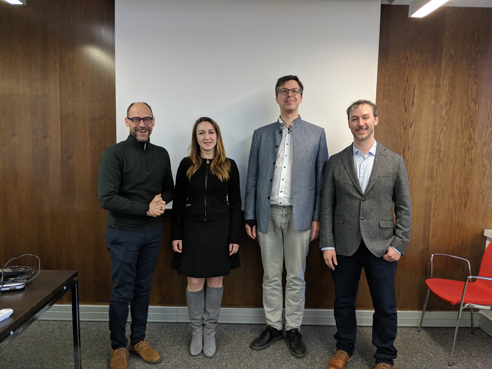
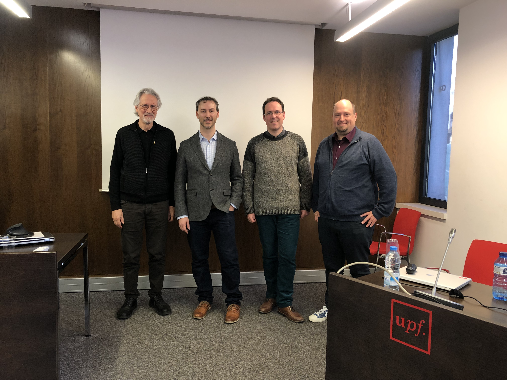

On January 28th, I successfully defended my PhD thesis "Cross-lingual Sentiment Analysis for Under-resourced Languages" and received the distinction "cum laude".

I would like to thank my two official supervisors, Toni Badia and Patrik Lambert, as well as the two supervisors of my research stay at Stuttgart, Roman Klinger and Sabine Schulte im Walde.

